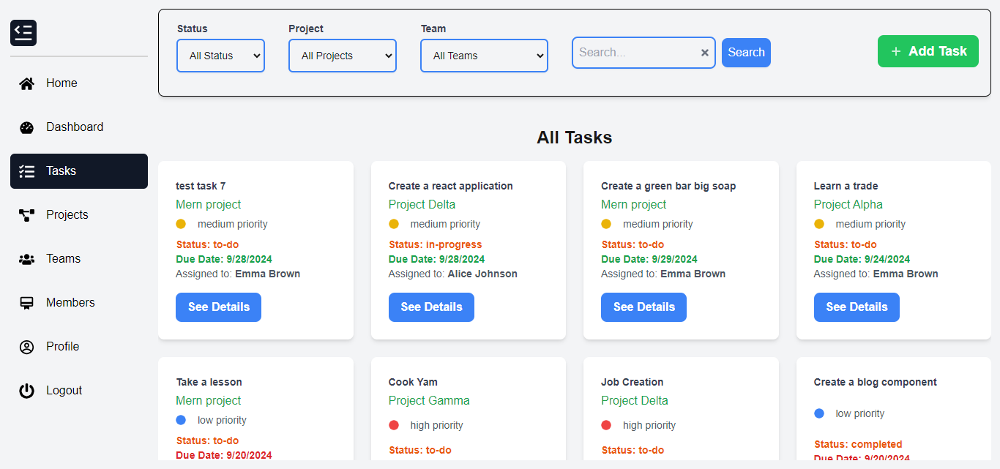

# dynamikManager



## Project Overview

Dynamik Task Manager is a robust task management system designed to streamline project workflows and improve team collaboration. Built using Next.js, React, and Tailwind CSS for a modern and responsive UI, and expressJs, NodeJs and MongoDB for database management. it supports real-time updates via WebSockets, ensuring teams stay synced on task progress. The system offers user authentication, role-based access control, and intuitive features for managing tasks, projects, and teams. Key functionalities include task sorting, filtering, and assignment, along with email notifications to keep users informed. With integration of Google reCAPTCHA for security and real-time notifications, Dynamik Task Manager is tailored for efficient and secure project management.

## Features

- Real-time task updates: Leverages WebSockets for immediate updates on task statuses and team progress.
- Project & Task Management: Create, assign, and track tasks within multiple projects.
- Password recovery and Email verification
- Team Collaboration: Assign tasks to team members, set deadlines, and track progress.
- Role-Based Access Control (RBAC): Role-specific permissions to manage tasks, projects, and teams.
- Task Filtering & Sorting: Sort tasks by status, project, or team with an intuitive filtering system.
- Notifications: Receive email notifications for task assignments, deadlines, and updates.
- Multi-select Task Assignment: Easily assign tasks to multiple members and projects via checkboxes or - multi-select fields.
  -Progress Tracking: Visual representation of task completion with a summary dashboard.
- Authentication: Secure login with JWT.
- Form Validation & CAPTCHA: Implements Google reCAPTCHA for form security.

### Tech Stack

Frontend:

- Next.js (React framework)
- Tailwind CSS (for styling)
- React Toastify (for notifications)

Backend:

- Node.js (with Express.js for API handling)
- WebSocket for real-time communication
- MongoDB (database) or MySQL for relational data

Authentication:

- Custom JWT-based authentication and session management

Other Libraries:

- Axios for API calls
- React Hook Form for form handling

## Getting Started

To get started with this project, follow the steps below:

### Installation

1. Clone the repository.

   ```sh
   https://github.com/ChinenyeNmoh/dynamikManager

   ```

2. Install the required packages.

   ```sh
   npm install package.json
   ```

   run this in both the backend and the frontend folder

3. Configure your .env file with your email and password credentials for sending mails and also the following fields.

   ```sh
   PORT=YOUR_PORT
   MONGO_URI=YOUR_MONGO_URI
   BASE_URL =BASE_URL
   HOST=EMAIL_HOST
   SERVICE=EMAIL_SERVICE
   PASS=GOOGLE_APP_PASSWORD
   USER=MAIL_USERNAME
   CLIENT_CAPTCHA=GOOGLE_RECAPTCHA_CLIENT
   SERVER_CAPTCHA=GOOGLE_RECAPTCHA_SECRET

   ```

### Start the application for development.

```sh
npm run dev --prefix ./backend

```

## Deployment

Frontend: The frontend is built with Next.js and deployed on Vercel for fast and reliable hosting, leveraging Vercel's optimized serverless infrastructure.
(https://dynamik-manager.vercel.app/)

Backend: The backend API and WebSocket server are hosted on DigitalOcean, ensuring scalability and security for handling real-time updates and API requests.

### Contributing

We welcome contributions from the community. If you have suggestions to make this project better, please create a pull request or open an issue with the "enhancement" tag. Don't forget to star the project if you find it useful!

License
This project is licensed under the MIT License - see the LICENSE file for details.

## Author

- Chinenye Nmoh [Github](https://github.com/ChinenyeNmoh/) / [Linkedin](https://www.linkedin.com/in/chinenye-nmoh-88479699/) / [Email](chinenyeumeaku@gmail.com)
